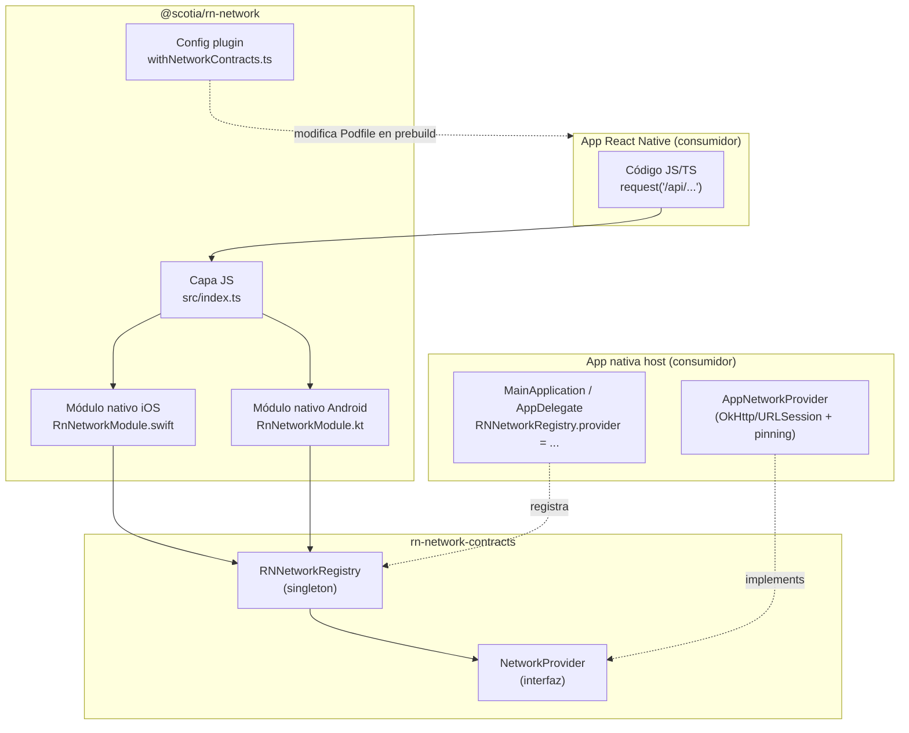
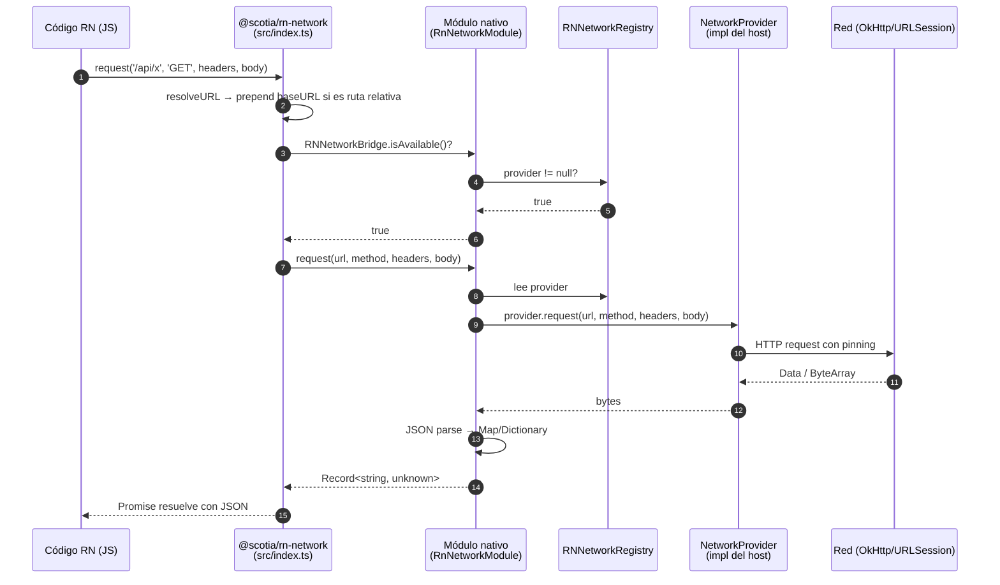
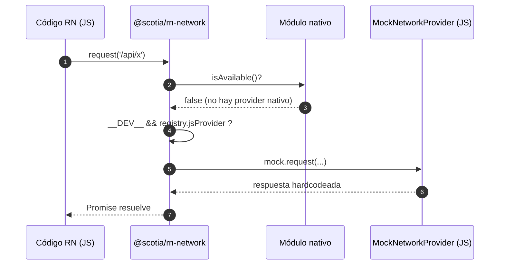
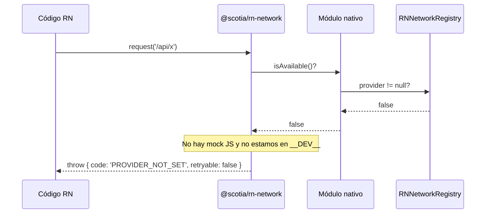
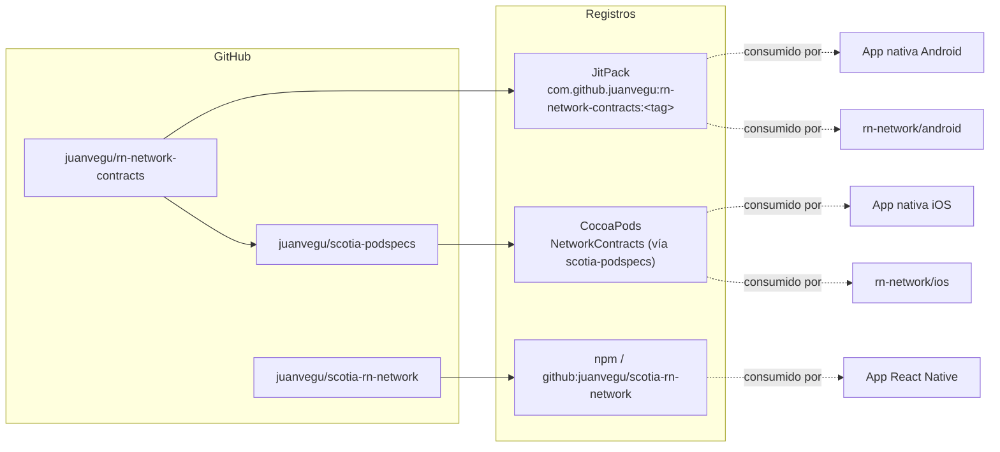

# Diagrama de arquitectura

## Componentes (vista lógica)

## Flujo de una request (secuencia)

## Caso de fallback (modo desarrollo)

## Caso de error

## Distribución / publicación

## Notas

- **Doble consumo de contracts**: tanto el módulo nativo de `rn-network` como la app host consumen `rn-network-contracts`. Ambos lados deben usar la **misma versión** para garantizar un único `RNNetworkRegistry` en el proceso (ver [Versionado y compatibilidad](../01-arquitectura/05-versionado-y-compatibilidad.md)).
- **Config plugin**: el plugin `withNetworkContracts` se ejecuta solo durante `npx expo prebuild` en la app RN, y modifica el `Podfile` (añadir source `scotia-podspecs`, forzar `NetworkContracts` como dynamic framework). No afecta Android.
