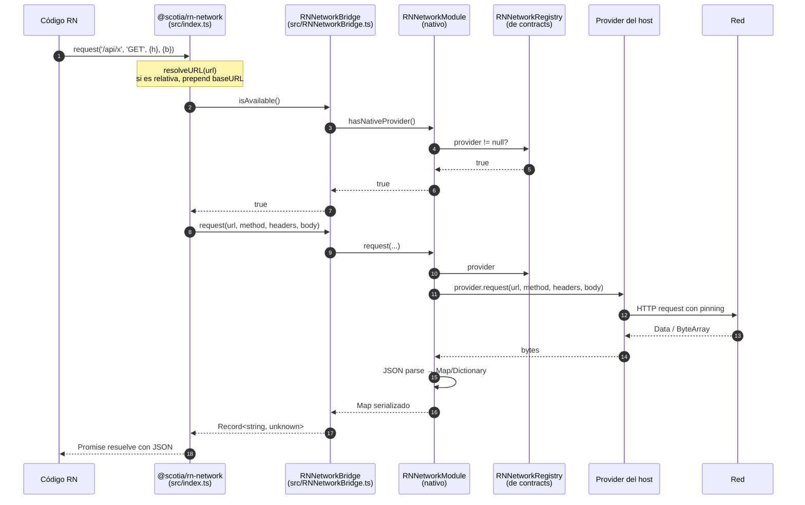
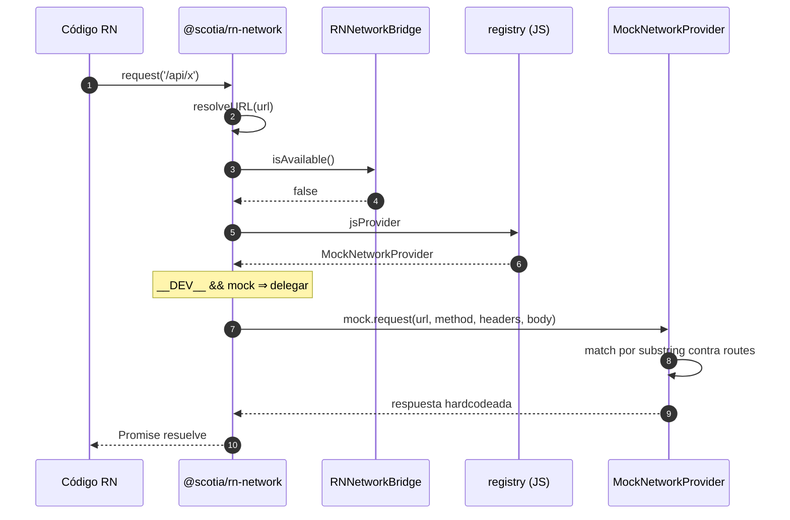
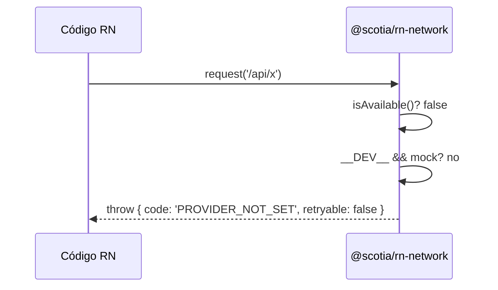

# Flujo de requests

Recorrido detallado de qué pasa cuando el código JS llama a `request()`.

## Caso 1 — Modo nativo (producción)

La app RN está embebida en una app nativa que registró un `NetworkProvider`.



## Caso 2 — Modo desarrollo con mock JS

`isAvailable()` retorna `false` (no hay módulo nativo o el provider no está registrado) y estamos en `__DEV__`. La app RN registró un `MockNetworkProvider` con `setProvider()`.



## Caso 3 — Sin provider (error)

`isAvailable()` es `false` **y** no hay mock JS (o no estamos en `__DEV__`).



## Resolución del URL (`resolveURL`)

```typescript
function resolveURL(url: string): string {
  if (url.startsWith('http://') || url.startsWith('https://')) return url
  const base = getBaseURL()
  if (!base) return url
  const path = url.startsWith('/') ? url : `/${url}`
  return `${base}${path}`
}
```

- URLs absolutas (`http(s)://...`) → se usan tal cual.
- URLs relativas → se prependen al `baseURL` activo.
- `baseURL` se obtiene de:
  1. **Modo nativo**: `RNNetworkBridge.getNativeBaseURL()`, que lee `appConfig.activeDomain` y busca su entrada en `appConfig.domains`.
  2. **Modo JS**: el valor seteado con `setBaseURL()` (guardado en `registry.baseURL` de la capa JS).

## Conversión de respuesta

El `NetworkProvider` nativo devuelve **bytes crudos** (`Data` en iOS, `ByteArray` en Android). El módulo nativo de `rn-network` se encarga de:

1. Decodificar los bytes como UTF-8.
2. Parsear como JSON.
3. Convertir a `Map<String, Any>` (Kotlin) o `[String: Any]` (Swift).
4. Devolver al puente JS, que lo recibe como `Record<string, unknown>`.

Si el parseo falla, el módulo nativo lanza `{ code: 'UNKNOWN', retryable: false }`.

> **Implicación:** la API actual asume que **todas** las respuestas son JSON objects (no arrays raíz, no texto plano, no binario). Si necesitas otros formatos, el contrato debería extenderse antes (ver [Decisiones técnicas](04-decisiones-tecnicas.md)).

## Mapeo de errores

El módulo nativo usa `NetworkErrorMapper` (interno) para traducir excepciones del provider o del stack de red a payloads tipados con forma `{ code, retryable, httpStatus? }`. La capa JS los re-lanza tal cual; ver [Manejo de errores](../04-referencia-api/05-manejo-de-errores.md) para la tabla completa.
